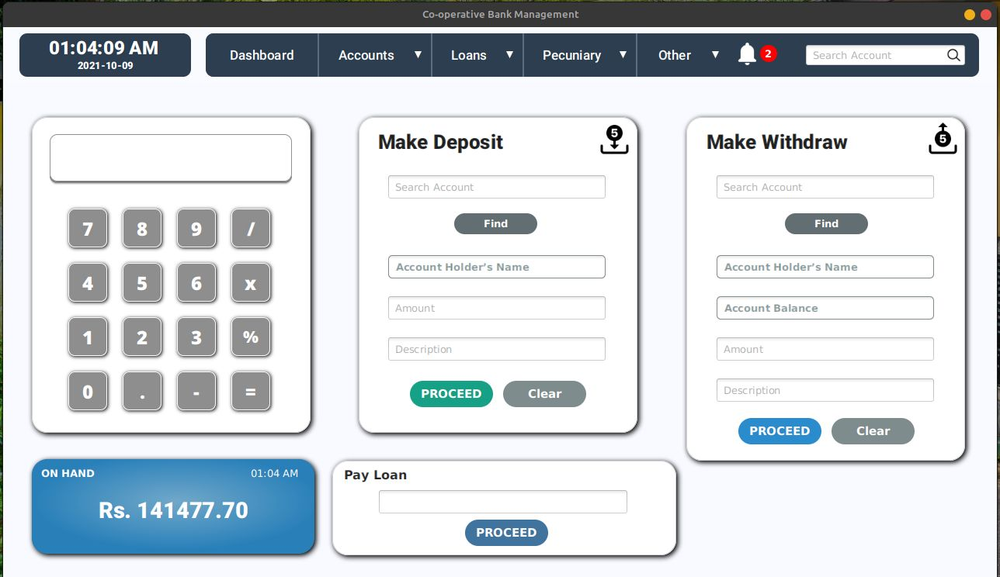

<code> Completed </code>   <code> first-semster project</code>

# Rural Co-operational Bank Management System

This project was done for my first semster final project. I used <code>Java</code> as the core language in this project. I obtained the information and reports to do this project from Galthude Sanasa Bank. Special thanks goes to manager in the Galthude Sanasa Bank.

## 1. Main Functionalities 

#### ➡️  Built-in Calculator 🧮
> In the main dashboard, there is a calculator for general calculations. <code> numeral-keys not supported yet</code>

#### ➡️  Handle User Accounts 
> ##### 1. Create member accounts. (can open accounts with or without deposit.)
> <code> Accounts > Open New Account </code> 
> ##### 2. Search Accounts

> Bank Manager can search account holders accounts from their account number. In the main dashboard search bar is for this feature. User can press <kbd> ENTER </kbd> after typing the account number.
> Search results will show the basic information about the account holder and as well as it shows the loan details such as payment details or next installment date if account holder have any loan. 

> On the right side will shows the account holder's main balance and holded amount if he/she have any loan by deposit. 
